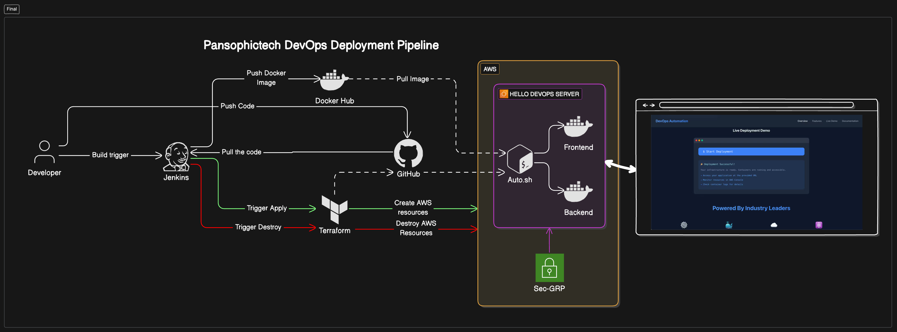

# Pansophic Technologies : First Project

# One-Click Deploy & One-Click Destroy

## Overview
The **One-Click Deploy & One-Click Destroy** project automates the deployment and destruction of a Docker-based application on AWS. This is achieved using a combination of Jenkins, Terraform, Docker Compose, and AWS EC2, streamlining the continuous integration and delivery process.

## Key Components
### Jenkins
- **Location**: Local Machine (Docker Container)
- **Purpose**: Automates the CI/CD pipeline.
### GitHub
- **Purpose**: Stores source code and triggers webhooks for Jenkins builds.
### Docker Hub
- **Purpose**: Cloud registry for storing Docker images.
### Terraform
- **Usage**: Provisions AWS infrastructure. Operates within the Jenkins container.
### AWS EC2
- **Purpose**: Hosts the application.
### Docker Compose
- **Location**: Inside EC2 Instance
- **Purpose**: Manages application containers.
## Configurations
- **Jenkins Webhook**: Triggers builds upon code pushes to GitHub.
- **AWS Credentials**: Configured using AWS CLI for authentication.
- **Docker Login**: Authenticates for image storage in Docker Hub.
- **Terraform**: Automates EC2 provisioning and cleanup.
## Workflow
1. **Code Push**: Developer pushes code to GitHub.
2. **Build Trigger**: Jenkins webhook triggers on GitHub push.
3. **Image Management**: Jenkins builds and pushes Docker image to Docker Hub.
4. **Provisioning**: Jenkins runs Terraform to provision AWS EC2.
5. **Setup on EC2**: Auto script installs Docker & Docker Compose, then pulls the Docker image.
6. **Container Management**: Docker Compose runs application containers.
7. **Cleanup**: Jenkins runs Terraform destroy for resource cleanup.
## Outcome
- **One-Click Deploy**: Fully automated application deployment on AWS.
- **One-Click Destroy**: Efficient resource cleanup.
[GitHub Repository](https://github.com/kiritbahir0337/hello-devops) 
